# Providing access to the CERN site

If you plan to have non-CERN participants at your event, you will have to provide them with **valid access badges**,
in line with the Organization's [badge-wearing policy](https://smb-dep.web.cern.ch/en/Security/News/Badge_wearing).

For security reasons, the Organization also requires any external participants to submit a few additional personal
data items, which will be processed according to the Organization's data privacy policies:

 * Birth Date
 * Nationality
 * Place of Birth
 * License Plate (if coming by car)

!!! question "*Can I collect and upload this data myself?*"
    **No.** Indico implements a workflow that **privileges user privacy** above everything else. This process
    was purposefully designed to avoid any "middlemen" in data processing. As convenient as such a "bulk upload"
    solution might seem, it would also increase the likelihood of data leaks and disrespect of CERN's Privacy
    Policies. Moreover, the current solution is **just as practical** (if not even more so).

    Please note that any data collected in this context will be **directly stored in Indico** and **never displayed to the event managers**. It will only be consulted by the Indico Service Manager at the request of the site surveillance service.

You will use Indico's registration workflow to **collect this personal data** and **produce access badges** that will
allow them to enter the CERN site. These badges can be either printed:

- At home by the participants and subsequently placed in a plastic cover attached to a lanyard (_Print at home_).
- By the [CERN Printshop](https://cern.service-now.com/service-portal/article.do?n=KB0005333) and handed to them at CERN site
entrance, by the conference organizers.

!!! danger "Attention"
    Please note that if you choose to print all access badges yourself (second option), it will be your responsibility
    to provide the CERN Printshop in time with a PDF containing all badges (see [instructions here](https://cern.service-now.com/service-portal/article.do?n=KB0005333)) and to distribute the badges to the
    participants before they enter the CERN site.

## Step-by-step instructions

The "CERN Visitor Badges" feature can be activated at any time, which means that you **can** activate it in an event that **already has participants**. The diagram below summarizes the workflows for a new event (blue) or an existing one with participants (red):

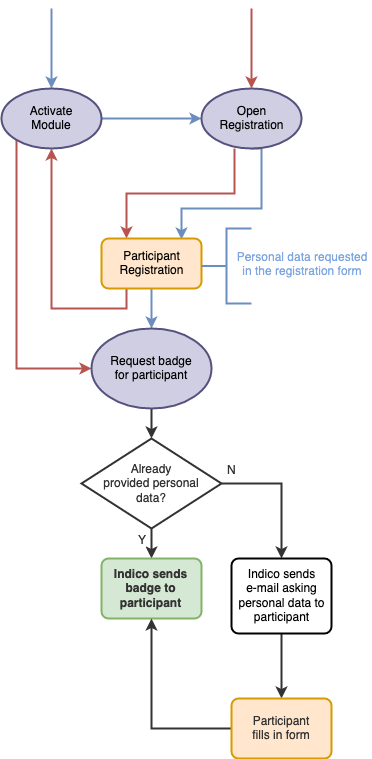

In general, you will have to go through the following steps, not necessarily in this order:

- Creating your Indico event
- [Creating a registration form](../conferences/registration_config.md)
- Letting users register, registering them yourself, or importing a participants list
- [Activating the site access module](#activating-the-visitor-badge-module)
- Optionally [setting up your own badge template](#access-badge-layout)
- [Granting access to individual participants](#granting-access-to-participants)
- Optionally [printing the badges yourself](#printing-badges)

## Activating the Visitor Badge Modle

In order to use the site access features, you need to activate them by going to the management page, under _Logistics_
in the _Services_ section → _CERN Visitor Badges_.
There are different options you should consider for your event:

- _Registration forms_ - select the registration forms for which you want to generate visitor badges
- _Show during user registration_ - this option lets you customize the personal data collection process:
    - _Yes_ - during registration users can select that they need the access to the CERN site and provide their personal data,
     if they don't and you request access for them, they will be asked to do it in another step
    - _Yes (required)_ - require all users to provide their data while registering (useful when all participants require a visitor badge)
    - _No_ - don't ask users for personal data during registration, request the information in another step only after
     requesting access for them
- _Start/end date override_ - by default the access is given from the beginning until the end of the event,
 but you can also specify when you want to let your event participants access the CERN site

After that you can proceed and click on _Send request_. You will receive a confirmation email within a few minutes.

!!! warning
    You need to be a member of the CERN personnel to request authorization.

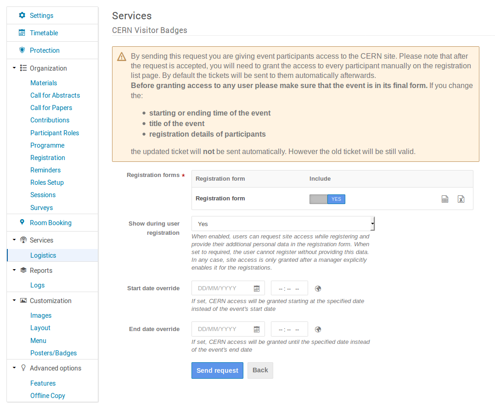

!!! warning
    Authorization in itself is not enough to provide the participants with a valid access badge. You will need to grant
    access to each one of them as explained below.

!!! tip
    Please keep in mind that if you change some event details (starting and ending time of the event, title of the
    event, registration details of participants...) the CERN access control system will be notified about the update and
    the old ticket will remain valid (if dates are changed then they will be taken into account).

The status of the request can be checked and it is also possible to edit and withdraw it.

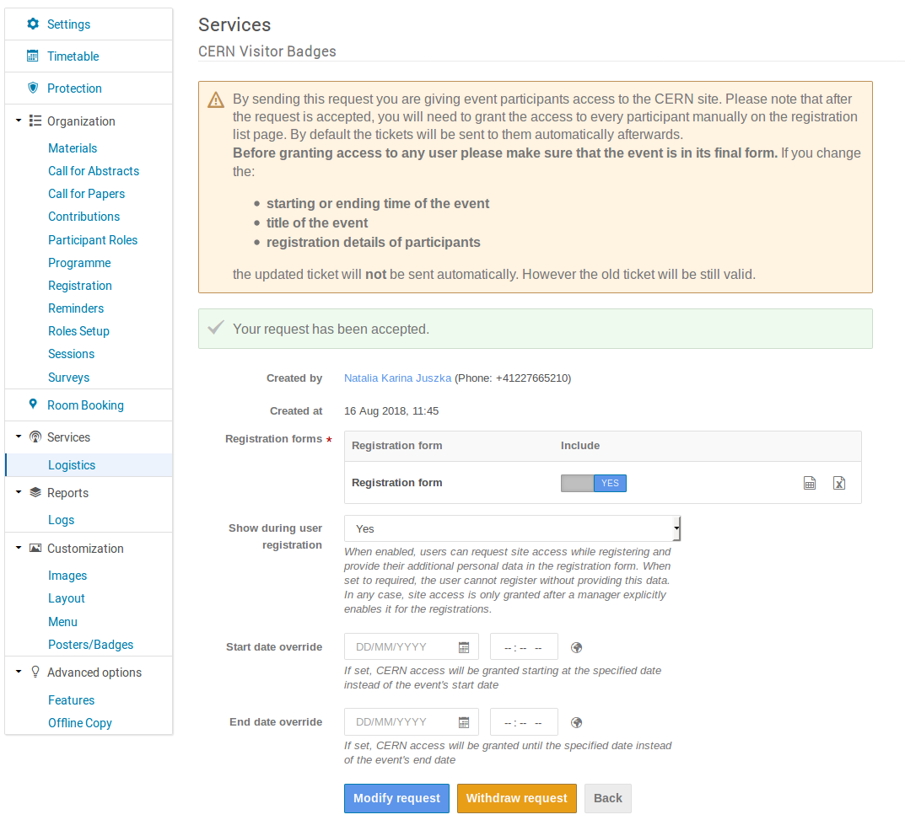

## Registration

If you decide to let the users ask for access to the CERN site when registering, the registration form will
have additional section where the users can indicate they want to get the access and provide their data

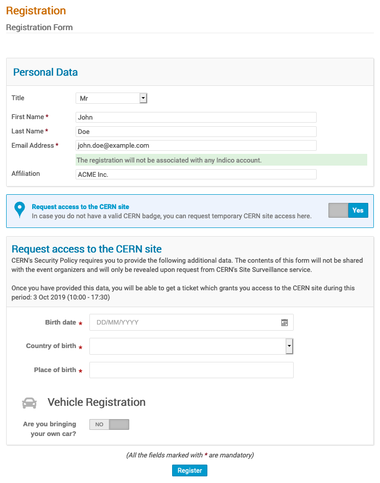

## Granting access to participants

The next step will be to request a badge for each participant who needs one, under _Registration_ (or _Participants_ for meetings and lectures) in the _Organization_
section &rarr; _Registrations_ (desired registration form).
On the list of registrations you need to select the desired participants, click on the dropdown button
_CERN Access control_ and select _Grant access_. Note that you can also revoke participants' access by choosing
_Revoke access_.

## Additional data request email

In order for the participants to get access to the CERN site, they have to provide additional data. When you choose to
grant access to the participants (_Grant access_ button) you will be prompted with a dialog. It displays the default text
of the email that will be sent to all participants that haven't provided their additional data yet. You can modify
the sender, the subject and the contents of the email and save it as a default for the event.

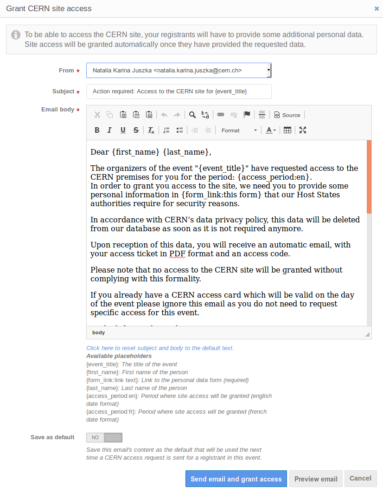

## Providing additional data

The participants that have been previously selected to have access will receive an email asking for personal
information needed to fulfill CERN's Security Policy. The participants that have already filled in personal data during
registration, will be granted access at this point.

!!! info "Important information"
    Any data submitted using this form will be accessible only to CERN's Site Surveillance Service and preserved for a
    maximum of one year, after which it will be deleted from Indico.

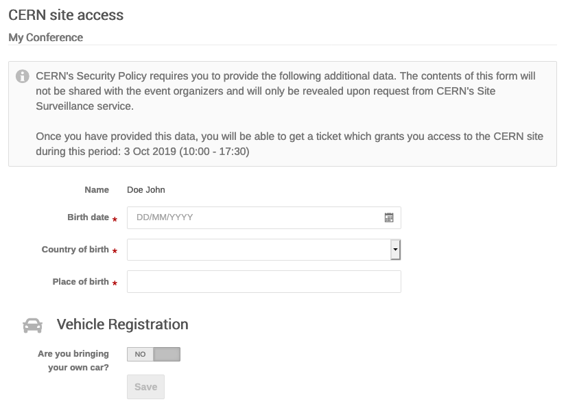

Once the participants have completed and sent the form, they will be redirected to a confirmation page where they can
get the access ticket and the registration code.

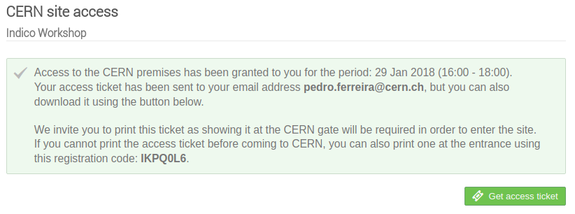

!!! note
    Additionally, a confirmation email containing the access ticket and the registration code will be sent to them.

Participants should then print the access ticket at home and bring it to the CERN entrance in order to get access. In
case they forget the ticket they can use an electronic kiosk at the CERN Reception to print the ticket using the
registation code they received.

!!! info
    Please note that the access ticket sent to the participants is A4 size. After printed, it should be folded in 4 in
    order to get a single or double-sided A6 that will then fit into a transparent plastic badge holder distributed at
    CERN gates.

## Checking participants status

On the list of registrations you can also see the current authorization status of each participant by checking the icon
on the left of each row.

!!! info
    - Yellow icon means that the participant needs to provide additional data, that is, to fill the
    [aforementioned personal information form](#providing-additional-data).
    - Blue icon means that participant has requested access to CERN and provided additional data,
     but the manager has not granted the access to this participant yet.
    - Green icon means that access to CERN has been granted to this participant. Event managers can retrieve the
    registration code of a participant by clicking on it.
    - Grey icon means that the manager of the event has not granted access to this participant.

## Providing information on behalf of the participant

!!! danger "Attention"
    This should be used **strictly in exceptional cases** (e.g. for a last minute participant). Participants should
    **always** be invited to fill in themselves their personal information otherwise.
    If you choose to fill the personal information form on behalf of a participant, then it is your responsibility to
    make sure that the information provided is accurate and to guarantee the express consent of the person.

As manager of the event it is also possible to enter the personal information on behalf of the participants, by clicking
on the yellow icon. This will open a dialog containing the [form previously mentioned](#providing-additional-data).

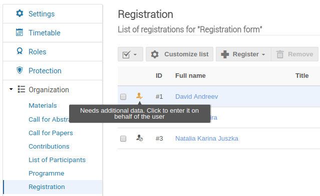

!!! warning
    Please note that you can only perform this action on behalf of the participants that have been selected to have
    access beforehand, meaning those that have the yellow icon.

## Access badge layout

Access badges for conference participants are single-sided by default (they use the pre-defined
_Official CERN Visitor Badge_ template), but they can also be double-sided (with one side containing the access-related information, and
the other the event-related data). In the latter case, you will need to create a dedicated badge template yourself.
For that purpose, you should go to the management page under _Posters/Badges_. Here it is possible to create a new badge
from scratch or duplicate an existing one from the _Inherited templates_ section and use it as basis for your access
badge. It will appear in the _Custom templates_ section.

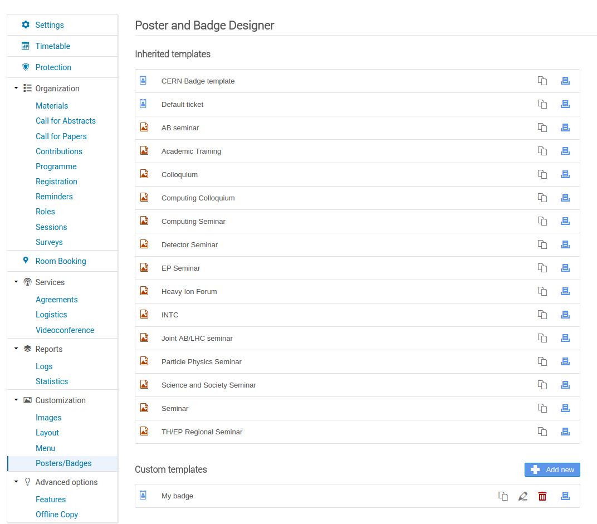

You can then edit the newly created template to fit your needs:

- On the back side, select the pre-defined _Official CERN Visitor Badge_ template: this will fill the back side with a
normal CERN visitor badge containing a QR code that will be scanned at the entrance.
- The front side can be fully customized and you can choose to include the conference logo or any other fields you find
relevant.

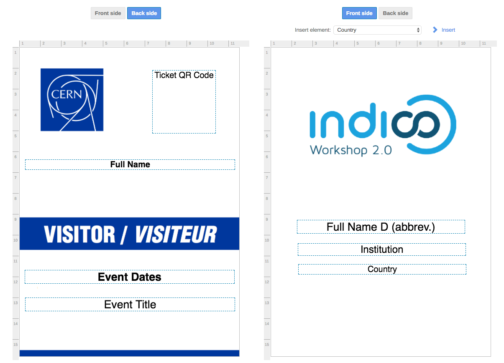

!!! note
    The size of the access badge template must be A6 portrait.

## Configuring the ticketing system

By default, Indico will select a one-sided access badge as the template to be printed. However, you can easily configure
it to use the one you've designed above. In the management page, under _Registration_, in the _Organization_ section, click
_Manage_ (next to the desired registration form). Then, click _Configure_ within the _Tickets_ section. There, you will see
the "Ticket template" field.

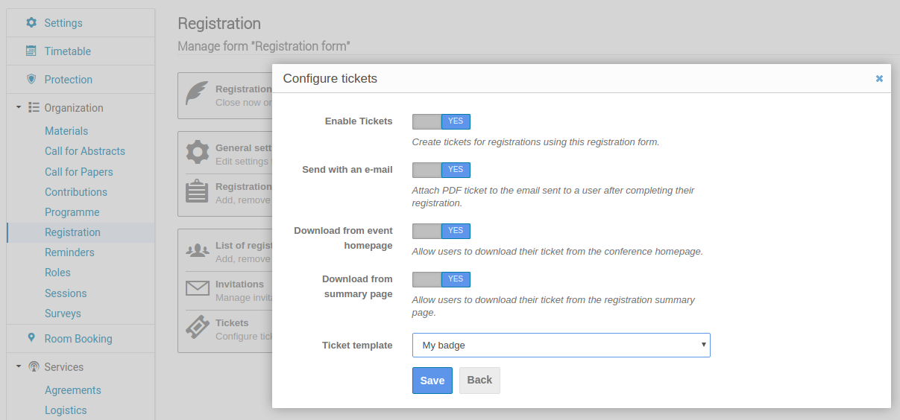

## Printing badges

By default, participants will receive their access badges directly by email, but you may want to print their access badges yourself and distribute them at the CERN reception.
To generate the PDF which will allow you to print these badges, you should go to the list of participants, select the participants for whom you want to print the access badges, then select _Print Tickets_ from the _Actions_ dropdown menu.

!!! warning
    You can print access badges only for participants who have filled in their security data. Selecting others will raise an error

!!! note
    The [CERN printshop](https://cern.service-now.com/service-portal/article.do?n=KB0005333) can print badges on A6 cardboard paper for you. For this, you need to provide them with an A4 PDF (4 A6 badges per page). You can generate this PDF through Indico by specifying 0 for all margins in the _Print Tickets_ form, _A4_ as _Page Size_ and _Portrait_ as _Page orientation_
